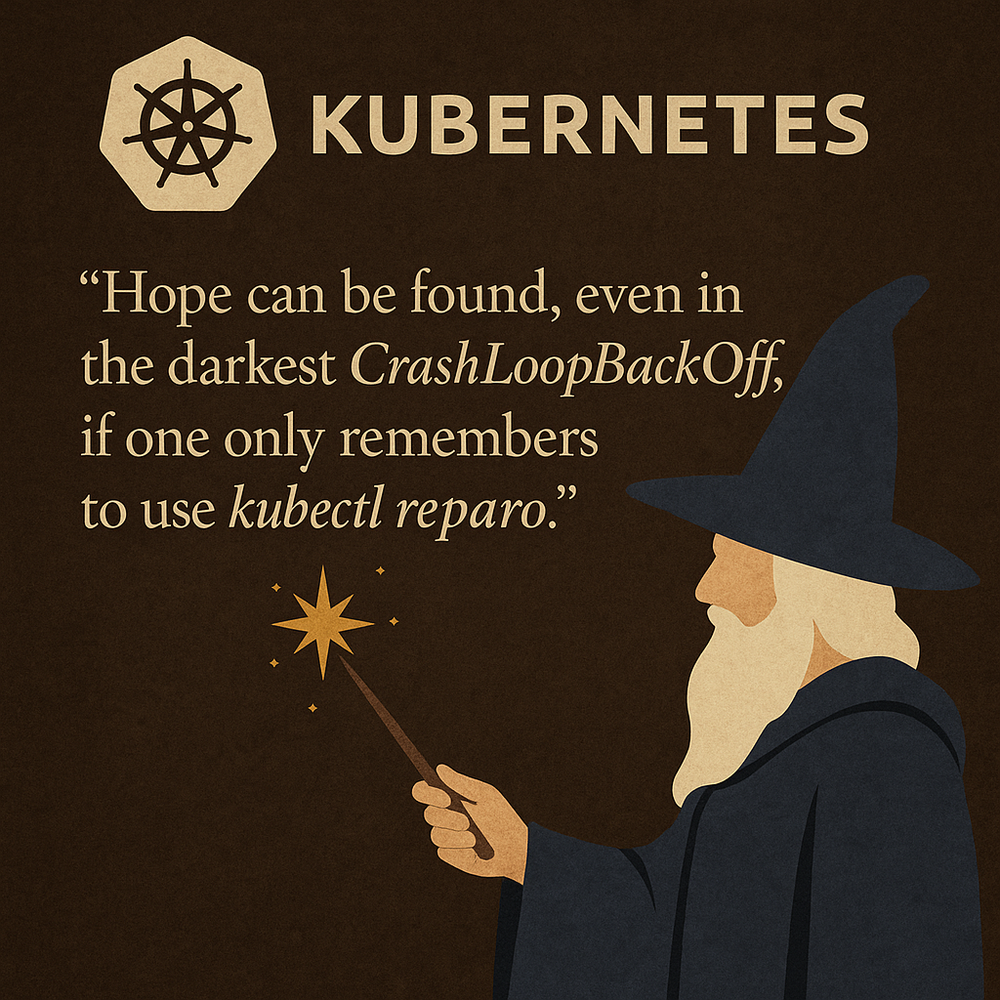

# 🔧 kubectl-reparo



> Smart conditional patching for Kubernetes resources  
> _"Hope can be found, even in the darkest CrashLoopBackOff, if one only remembers to use kubectl reparo."_

[](https://krew.sigs.k8s.io/plugins/)

---

## ✨ What is it?

`kubectl-reparo` is a powerful CLI plugin to **surgically patch Kubernetes resources** using human-friendly filters.

✔️ Patch only if specific fields match  
✔️ Supports CRDs and native resources  
✔️ Works across namespaces  
✔️ Supports dry-run mode  
✔️ YAML diffs to preview changes  
✔️ Advanced filtering with comparison and regex

---

## 🔍 Use Cases

- Update all `deployments` with `replicas=1` to `replicas=2`
- Patch based on label selectors or numeric comparisons

---

## 🧙 Getting Started

### ✅ Install via Krew (coming soon)

```bash
kubectl krew install reparo
```

### 🔧 Or build locally

```bash
git clone https://github.com/dhruvbehl/kubectl-reparo.git
cd kubectl-reparo
go build -o kubectl-reparo
sudo mv kubectl-reparo /usr/local/bin
```

---

## 🛠 Usage

```bash
kubectl reparo <resource> [name] [flags]
```

---

## ⚙️ Flags

| Flag            | Description |
|-----------------|-------------|
| `--set`         | Fields to set in `key=value` format (comma-separated) |
| `--where`       | Conditions to match using `key<op>value`. Comma = AND, multiple `--where` = OR. Supports `=`, `!=`, `<`, `<=`, `>`, `>=`, `~`, `!~` |
| `--selector`    | Kubernetes label selector |
| `--namespace`   | Target namespace |
| `-A`            | All namespaces |
| `--dry-run`     | Simulate patch without applying |
| `--output`      | Show YAML diff when used with dry-run |

---

## 🧪 Example Output

```diff
-  deploymentReplicas: 1
+  deploymentReplicas: 3
```

---

## 📦 Supported Resource Types

- Native K8s resources: `deployments`, `pods`, etc.
- Custom Resources (CRDs): like `kpack`, etc.

---

## 🧠 Why “Reparo”?

From the wizarding world of Harry Potter, **Reparo** is the spell to _repair broken objects_.  
This tool _repairs broken state_ in your K8s resources — smartly and safely.

---

## 📜 License

[MIT](LICENSE)

